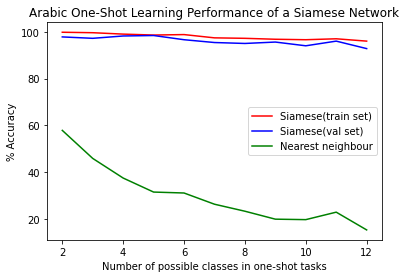

# **Arabic-handwritten-one-shot-learning**

Implementation of Siamese network for handwritten Arabic characters using Keras.

## Dataset
* The dataset is available on Kaggle [here](https://www.kaggle.com/mloey1/ahcd1).
* I have used 60% of the characters (16 characters) for training and used the other 40% for testing (12 characters).
* I chose 20 images for each class (character) randomly using different seeds and the performance was similar for each seed.

## Performance
* The validation was done using N-way one shot learning over 500 trials with N in range (2-12).
* I have also tested it against Nearest neighbour.
* The training and validation were done using GPU and Google Colab.
* Accuracy is 92.8% for test data.

## References
* [One shot learning with Siamese Netwirk using Keras blog](https://towardsdatascience.com/one-shot-learning-with-siamese-networks-using-keras-17f34e75bb3d)
* [Siamese explanation line by line blog](https://towardsdatascience.com/siamese-networks-line-by-line-explanation-for-beginners-55b8be1d2fc6)
* [Siamese Neural Networks for One-shot Image Recognition
](https://www.cs.cmu.edu/~rsalakhu/papers/oneshot1.pdf)